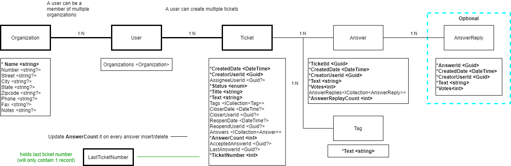

# [ABP Suite](https://commercial.abp.io/tools/suite) - Help Desk Tutorial - Part 1

## About this tutorial:

- Part-1: - Help Desk Domain Model
- [Part-2: - Create the Help Desk Solution](Part2-MVC-CreateHelpDeskSoluton.md)
- [Part-3: - Create the Help Desk Entities](Part3-MVC-CreateHelpDeskEntities.md)
- [Part-4: - Customize the Help Desk](Part4-MVC-CustomizeHelpDesk.md)

## Domain Model

[HelpDeskDomainModel.drawio](HelpDeskDomainModel.drawio) open with [draw.io](https://app.diagrams.net)

#### Domain Model Entities

\* denotes required fields.

##### TicketStatus : Enum { Open, In Progress, On Hold, Close }

##### Organization : FullAuditedAggregateRoot\<Guid>
|   | Property         | Type                        | Min  | Max  | Examples                         |
|---|------------------|-----------------------------|-----:|-----:|----------------------------------|
|   | Number           | string?                     |      | 50   | CID-00001, CUST-00001, BW-000001 |
| * | Name             | string                      |      | 50   | Acme, ABC, Volo                  |
|   | Street           | string?                     |      | 50   | 1 Acme Way                       |
|   | City             | string?                     |      | 50   |                                  |
|   | State            | string?                     |      | 50   |                                  |
|   | Zipcode          | string?                     |      | 15   |                                  |
|   | Phone            | string?                     |      | 15   |                                  |
|   | Fax              | string?                     |      | 15   |                                  |
|   | Notes            | string?                     |      | 1024 |                                  |

##### AppUser : FullAuditedAggregateRoot\<Guid>
|   | Property         | Type                        | Min  | Max  | Examples                         |
|---|------------------|-----------------------------|-----:|-----:|----------------------------------|
| * | Organizations    | ICollection\<Organization>  |      |      |                                  |

##### Ticket : FullAuditedAggregateRoot\<Guid>
|   | Property         | Type                        | Min  | Max  | Examples                         |
|---|------------------|-----------------------------|-----:|-----:|----------------------------------|
| * | TicketNumber     | int                         |      |      | Sequencial Number                |
| * | CreatedDate      | DateTine                    |      |      |                                  |
| * | CreatorUserId    | Guid                        |      |      | Navigation Property              |
|   | AssigneeUserId   | Guid?                       |      |      | Navigation Property              |
| * | Status           | enum                        |      |      | Open                             |
| * | Title            | string                      |      | 250  |                                  |
| * | Text             | string                      |      | 1024 |                                  |
| * | Tags             | string                      |      | 500  |                                  |
| * | Tags             | ICollection\<Tag>           |      |      |                                  |
|   | CloserDate       | DateTine?                   |      |      |                                  |
|   | CloserUserId     | Guid?                       |      |      | Navigation Property              |
|   | ReopenDate       | DateTine?                   |      |      |                                  |
|   | ReopendUserId    | Guid?                       |      |      | Navigation Property              |
|   | Answers          | ICollection\<Answer>        |      |      |                                  |
| * | AnswerCount      | int                         |      |      |                                  |
|   | AcceptedAnswerId | Guid?                       |      |      | Navigation Property              |
|   | LastAnswerId     | Guid?                       |      |      | Navigation Property              |

##### Answer : FullAuditedAggregateRoot\<Guid>
|   | Property         | Type                        | Min  | Max  | Examples                         |
|---|------------------|-----------------------------|-----:|-----:|----------------------------------|
| * | TicketId         | Guid                        |      |      | Navigation Property              |
| * | CreatedDate      | DateTine                    |      |      |                                  |
| * | CreatorUserId    | Guid                        |      |      | Navigation Property              |
| * | Text             | string                      |      |      | Navigation Property              |
| * | Votes            | int                         |      |      |                                  |
|   | AnswerReplies    | ICollection\<Reply>         |      |      |                                  |
| * | AnswerReplyCount | int                         |      |      |                                  |

##### AnswerReply : FullAuditedAggregateRoot\<Guid>
|   | Property         | Type                        | Min  | Max  | Examples                         |
|---|------------------|-----------------------------|-----:|-----:|----------------------------------|
| * | AnswerId         | Guid                        |      |      | Navigation Property              |
| * | CreatedDate      | DateTine                    |      |      |                                  |
| * | CreatorUserId    | Guid                        |      |      | Navigation Property              |
| * | Text             | string                      |      |      | Navigation Property              |
| * | Votes            | int                         |      |      |                                  |

##### Back to the [Help Desk Tutorial](/README.md), or on to the next step [Creating Help Desk Solution](CreatingHelpDeskSolution.md)
