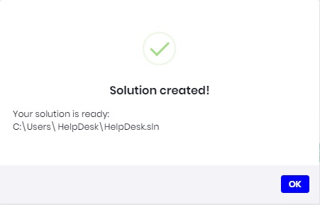

# [ABP Suite](https://commercial.abp.io/tools/suite) - Help Desk Tutorial - Part 2

## About this tutorial:

- [Part-1: - Help Desk Domain Model](Part1-HelpDeskDomainModel.md) 
- Part-2: - Create the Help Desk Solution
- [Part-3: - Create the Help Desk Entities](Part3-MVC-CreateHelpDeskEntities.md)
- [Part-4: - Customize the Help Desk](Part4-MVC-CustomizeHelpDesk.md)

##### Back to the [Help Desk Entities](HelpDeskEntities.md), or on to the next step [Creating the Help Desk Entities](CreateHelpDeskEntities.md)

### Start ABP Suite

1. Open Administrator: Command Prompt
2. Login to ABP ```abp login user -p password```
3. Start ABP Suite ```abp suite```

Your browser should automatically open to ```http://localhost:3000/```

### Create Help Desk Solution

**NOTE**: For additional information please see: [Creating a new ABP solution](https://docs.abp.io/en/commercial/latest/abp-suite/create-solution)

1. In ABP Suite, click the ```Create a new solution``` button.
2. Next enter HelpDesk in the Project name field.
3. Set your output folder to your desired output location.
4. Optionaly, check ```Create solution folder```
5. For this tutorial we will select None for the Mobile option.
6. Finaly click OK to creat the solution.


### Help Desk Solution Created

If all goes will you should receive 




##### Back to the [Help Desk Entities](HelpDeskEntities.md), or on to the next step [Creating the Help Desk Entities](CreateHelpDeskEntities.md)