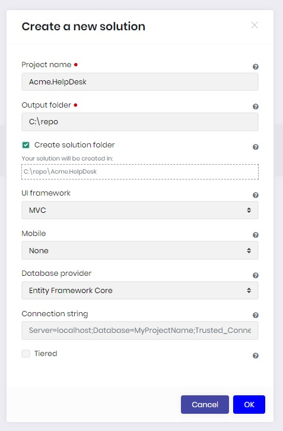
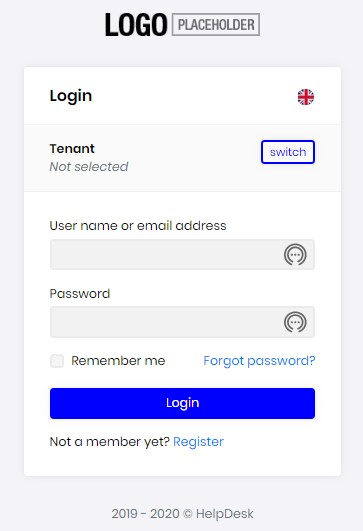

# [ABP Suite](https://commercial.abp.io/tools/suite) - Help Desk Tutorial - Part 2

## About this tutorial:

- [Part-1: - Help Desk Domain Model](Part1-HelpDeskDomainModel.md) 
- Part-2: - Create the Help Desk Solution
- [Part-3: - Create the Help Desk Entities](Part3-MVC-CreateHelpDeskEntities.md)
- [Part-4: - Customize the Help Desk](Part4-MVC-CustomizeHelpDesk.md)

## Start ABP Suite

1. Open Administrator: Command Prompt
2. Login to ABP ```abp login user -p password```
3. Start ABP Suite ```abp suite```

Your browser should automatically open to ```http://localhost:3000/```

## Create the Help Desk Solution

**NOTE**: For additional information please see: [Creating a new ABP solution](https://docs.abp.io/en/commercial/latest/abp-suite/create-solution)

1. In ABP Suite, click the ```Create a new solution``` button.
2. Next enter HelpDesk in the Project name field.
3. Set your output folder to your desired output location.
4. Optionaly, check ```Create solution folder```
5. For this tutorial we will select None for the Mobile option.
6. Finaly click OK to creat the solution.



7. If all goes as expectd you should receive the "Solution created!" message.

## Deploy the initial HelpDesk database migration

Now that the NuGet packages have been updated, and the project builds sussfully its time to deploy the database initial migration.

1. Set the HelpDesk.DbMigrator project as the startup project by right clicking on the HelpDesk.DbMigrator project and clicking ```Set as Startup Project``` 
2. Next Run the project ```Press F5``` and wait for it to complete the databasea migration deployment.
3. Finally, Press any key to close the Console windows when prompted.

## Start the HelpDesk.Web

Now that the Help Desk database has been deployed, the next step is to start the Help Desk.

1. Set the HelpDesk.Web as the startup project by right clicking on the HelpDesk.Web project and clicking ```Set as Startup Project``` 
2. Next Run the project ```Press F5``` and wait for the Help Desk to start.
3. Finally, log into the Help Desk using the default username ```admin``` and password ```1q2w3E*```.




