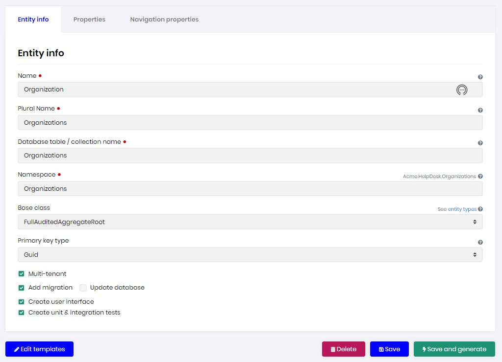
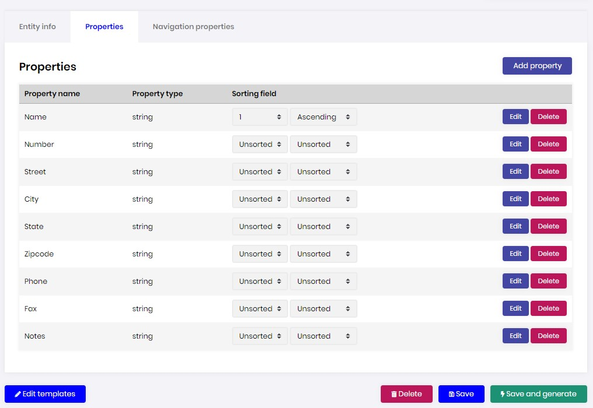
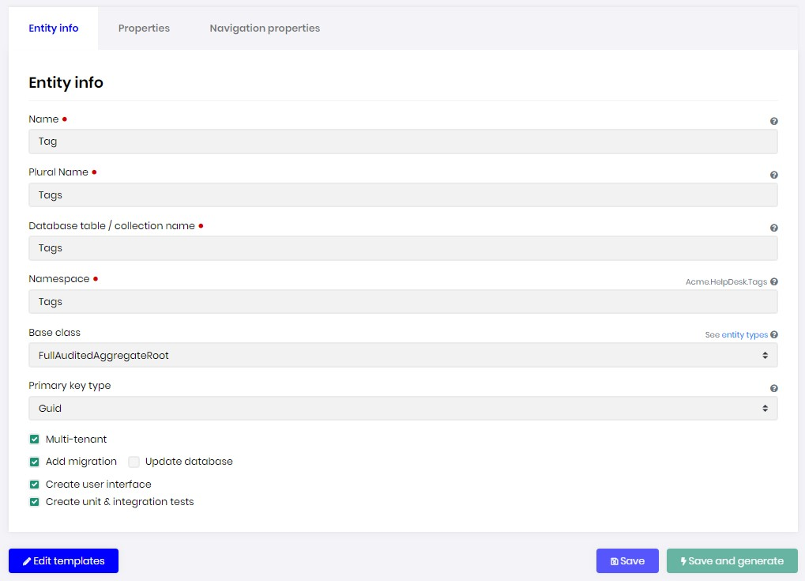
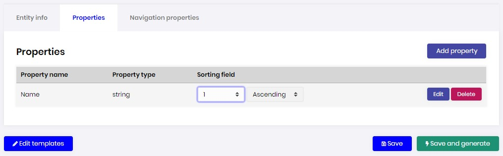
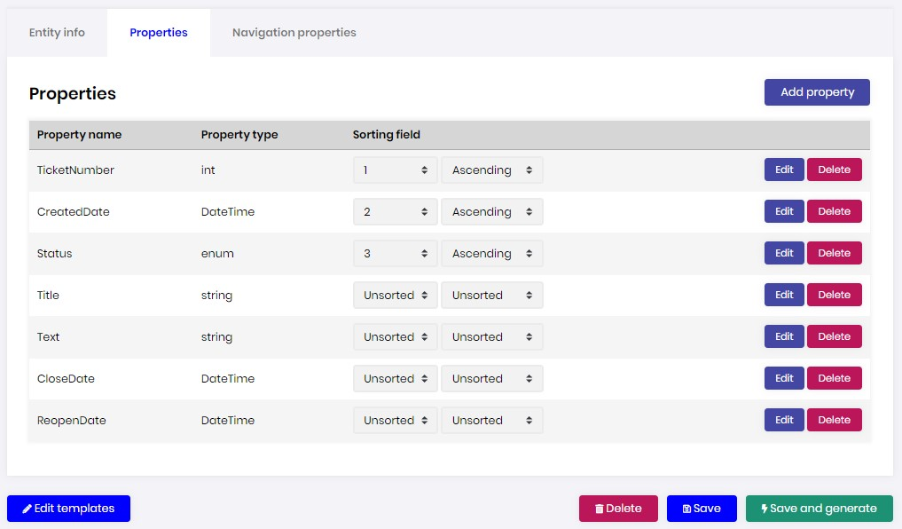
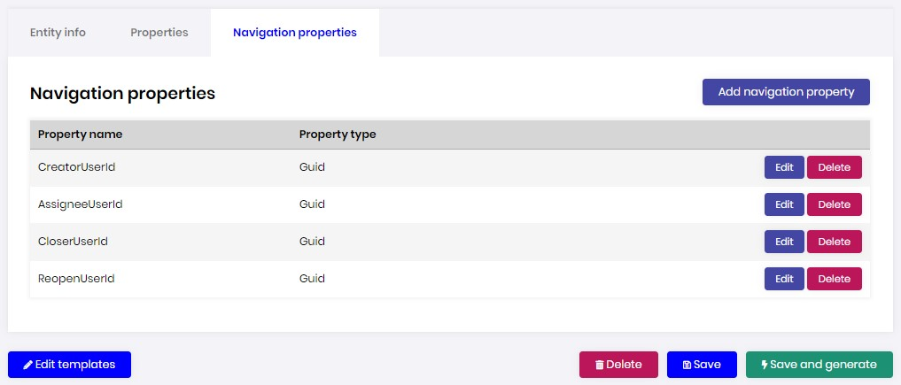

# Acme Help Desk Tutorial - Part 3

### About this tutorial:

- [Part-1: - Help Desk Domain Model](Part1-HelpDeskDomainModel.md) 
- [Part-2: - Create the Help Desk Solution](Part2-MVC-CreateHelpDeskSoluton.md)
- Part-3: - Create the Help Desk Entities
- [Part-4: - Customize the Help Desk](Part4-MVC-CustomizeHelpDesk.md)

### Overview

In this tutorial we will demonstrate how to build the Help Desk entities outlined in [Part-1: - Help Desk Domain Model](Part1-HelpDeskDomainModel.md).

### Create TicketStatus
<details>
    <summary>###Click to expand!</summary>    
In the `Acme.HelpDesk.Domain.Shared` project, create a new folder named `TicketStatus`.
Next, in the `TicketStatus` folder create a new class file named `TicketStatus.cs` containing the following code.

**NOTE**: Make sure the namespace is `Acme.HelpDesk` **NOT** `Acme.HelpDesk.TicketStatus`

#### TicketStatus.cs

```c#
namespace Acme.HelpDesk
{
    public enum TicketStatus
    {
        New,
        InProgress,
        OnHold,
        Closed,
    }
}
``` 
</details>

### Create Oranization

In ABP Suite click `CRUD Page Generator` and fill in the `Entity info` tab as follows.



Next, fill in the `Properties` tab as follows.



Next, click `Save and generate`.

Next, deploy the Organization migration using the DBMigrator.

Finally, run the Helpd Desk web application and explore the Organization.

### Extend AppUser

### Create Tag

In the `ABP Suite CRUD Page Generator` and fill in the `Entity info` tab as follows.



Next, fill in the `Properties` tab as follows.



Next, click `Save and generate`.

Next, deploy the Organization migration using the DBMigrator.

Finally, run the Helpd Desk web application and explore the Organization.

### Create Ticket

In the `ABP Suite CRUD Page Generator` and fill in the `Entity info` tab as follows.


Next, fill in the `Properties` tab as follows.



Next, fill in the `Navigation properties` tab as follows.



Next, click `Save and generate`.

Next, deploy the Organization migration using the DBMigrator.

Finally, run the Helpd Desk web application and explore the Organization.


### Create Answer


